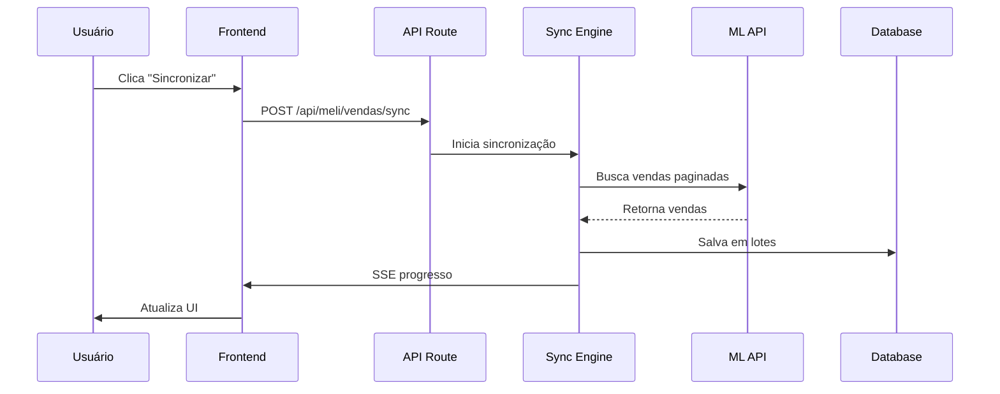
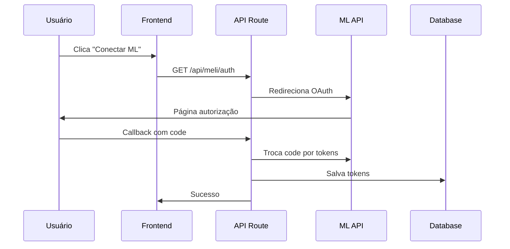
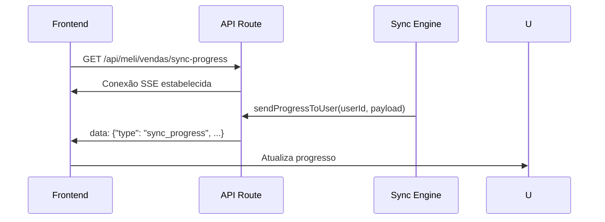

# 🏗️ Arquitetura Técnica - ContaZoom

## Visão Geral

O ContaZoom é uma aplicação full-stack construída com Next.js 15, utilizando uma arquitetura moderna e escalável para sincronização de vendas do Mercado Livre.

## 🏛️ Arquitetura de Software

### Padrão Arquitetural

```
┌─────────────────────────────────────────────────────────────┐
│                    Frontend Layer                           │
│  ┌─────────────────────────────────────────────────────┐    │
│  │  React 19 + Next.js 15 (App Router)               │    │
│  │  • Componentes UI (Tailwind CSS)                  │    │
│  │  • Client-side state management                    │    │
│  │  • SSE client para progresso em tempo real         │    │
│  └─────────────────────────────────────────────────────┘    │
└─────────────────────────────────────────────────────────────┘
                                 │
                    ┌────────────────────┐
                    │  API Routes Layer  │
                    │  (Next.js API)     │
                    │  • RESTful APIs    │
                    │  • JWT Auth        │
                    │  • OAuth handling  │
                    │  • SSE server      │
                    └────────────────────┘
                                 │
                    ┌────────────────────┐
                    │  Business Logic    │
                    │  • Sync engine     │
                    │  • ML API client   │
                    │  • Data processing │
                    │  • Error handling  │
                    └────────────────────┘
                                 │
                    ┌────────────────────┐
                    │  Data Layer        │
                    │  • Prisma ORM      │
                    │  • PostgreSQL      │
                    │  • Migrations      │
                    │  • Transactions    │
                    └────────────────────┘
```

## 📦 Componentes Principais

### 1. Frontend (Next.js App Router)

#### Páginas
- `/` - Dashboard principal
- `/login` - Autenticação
- `/dashboard` - Analytics e métricas
- `/vendas/*` - Gestão de vendas
- `/contas` - Contas conectadas
- `/financeiro/*` - Relatórios financeiros

#### Componentes
- **Views**: Páginas principais (`Dashboard.tsx`, `VendasMercadolivre.tsx`)
- **UI Components**: Reutilizáveis (`Modal.tsx`, `TabelaVendas.tsx`)
- **Charts**: Gráficos (`GraficoPeriodo.tsx`, `MapaCalorBrasil.tsx`)

#### Hooks Customizados
- `useVendasSyncProgress.ts` - SSE para progresso
- `useSyncProgress.ts` - Progresso financeiro
- `useAuth.ts` - Autenticação

### 2. API Routes

#### Autenticação
- `POST /api/auth/login` - Login JWT
- `POST /api/auth/logout` - Logout
- `GET /api/auth/me` - Verificar sessão

#### Mercado Livre
- `GET /api/meli/accounts` - Listar contas
- `POST /api/meli/accounts/new` - Conectar conta
- `GET /api/meli/auth` - Iniciar OAuth
- `GET /api/meli/callback` - Callback OAuth
- `POST /api/meli/refresh-token` - Refresh token

#### Sincronização
- `POST /api/meli/vendas/sync` - Iniciar sync
- `GET /api/meli/vendas/sync-progress` - SSE progresso
- `GET /api/meli/vendas` - Listar vendas

#### Dashboard
- `GET /api/dashboard/stats` - Estatísticas gerais
- `GET /api/dashboard/series` - Séries temporais
- `GET /api/dashboard/faturamento-por-*` - Analytics

### 3. Business Logic

#### Sync Engine
```typescript
// src/lib/sync-engine.ts
class MercadoLivreSyncEngine {
  async syncAccount(account: MeliAccount): Promise<SyncResult>
  async fetchOrdersPaginated(params: FetchParams): Promise<OrderPayload[]>
  async saveOrdersBatch(orders: OrderPayload[]): Promise<SaveResult>
}
```

#### ML API Client
```typescript
// src/lib/meli.ts
class MercadoLivreAPI {
  async getOrders(params: OrderParams): Promise<MeliOrder[]>
  async refreshToken(account: MeliAccount): Promise<TokenResult>
  async getShipments(orderIds: string[]): Promise<Shipment[]>
}
```

#### SSE Manager
```typescript
// src/lib/sse-progress.ts
class SSEProgressManager {
  addConnection(userId: string, controller: Controller): void
  sendProgress(userId: string, payload: ProgressPayload): void
  closeConnections(userId: string): void
}
```

### 4. Data Layer

#### Schema Prisma
```prisma
model User {
  id                String   @id @default(uuid())
  email             String   @unique @db.Citext
  passwordHash      String   @map("password_hash")
  // ... outros campos
}

model MeliAccount {
  id                    String   @id @default(cuid())
  userId                String
  ml_user_id            BigInt
  access_token          String
  refresh_token         String
  expires_at            DateTime
  // ... relacionamentos
}

model MeliVenda {
  id                 String   @id @default(cuid())
  orderId            String   @unique
  userId             String
  meliAccountId      String
  dataVenda          DateTime
  // ... campos de venda
}
```

#### Índices Otimizados
```sql
-- Índices compostos para performance
CREATE INDEX idx_meli_venda_user_data ON meli_venda(user_id, data_venda DESC);
CREATE INDEX idx_meli_venda_order ON meli_venda(order_id);
CREATE INDEX idx_meli_venda_sku ON meli_venda(sku);
```

## 🔄 Fluxos de Dados

### 1. Sincronização de Vendas



### 2. Autenticação OAuth



### 3. SSE em Tempo Real



## 🛡️ Segurança

### Autenticação
- **JWT HS256** com expiração de 7 dias
- **Cookies HTTP-only** para tokens
- **Middleware** de proteção em rotas
- **Refresh automático** de tokens

### Autorização
- **Row Level Security** no banco
- **User-scoped queries** em todas as operações
- **Token validation** em cada request

### OAuth Security
- **PKCE** para proteção adicional
- **State parameter** contra CSRF
- **Token encryption** no banco
- **Mutex** para refresh concorrente

## ⚡ Performance

### Otimizações Implementadas

#### Database
- **Índices compostos** para queries principais
- **Batch inserts** de 50 registros
- **Connection pooling** automático
- **Query optimization** com EXPLAIN

#### API
- **Rate limiting** automático
- **Retry com backoff** exponencial
- **Concurrent requests** até 5 simultâneas
- **Timeout handling** gracioso

#### Frontend
- **Lazy loading** de componentes
- **Memoization** de cálculos pesados
- **Virtual scrolling** em tabelas grandes
- **Progressive loading** de dados

### Benchmarks

| Operação | Tempo Esperado | Status |
|----------|----------------|--------|
| Login | < 500ms | ✅ |
| Sync 100 vendas | < 10s | ✅ |
| Sync 1000 vendas | < 30s | ✅ |
| Query dashboard | < 2s | ✅ |
| SSE latency | < 100ms | ✅ |

## 🚀 Deploy e Escalabilidade

### Vercel (Frontend + API)
- **Serverless functions** para APIs
- **Edge network** global
- **Automatic scaling** baseado em demanda
- **Environment variables** seguros

### PostgreSQL (Database)
- **Connection pooling** automático
- **Read replicas** para queries pesadas
- **Automatic backups** diários
- **Point-in-time recovery**

### Monitoramento
- **Error tracking** com Sentry
- **Performance monitoring** com Vercel Analytics
- **Database monitoring** com pg_stat_statements
- **Custom metrics** para sync operations

## 🔧 Manutenção e Operações

### Logs Estruturados
```json
{
  "timestamp": "2024-01-01T12:00:00Z",
  "level": "info",
  "service": "meli-sync",
  "userId": "user-123",
  "accountId": "acc-456",
  "operation": "sync_start",
  "duration": 1500,
  "ordersFetched": 250
}
```

### Health Checks
- **API health**: `/api/health`
- **Database connectivity**: Connection tests
- **External APIs**: ML API availability
- **Memory usage**: Automatic alerts

### Backup Strategy
- **Database**: Daily automated backups
- **Code**: Git versioning
- **Configuration**: Environment variables
- **Assets**: CDN with versioning

---

## 📚 Referências

- [Next.js App Router Documentation](https://nextjs.org/docs/app)
- [Prisma ORM Guide](https://www.prisma.io/docs)
- [Mercado Livre API Docs](https://developers.mercadolivre.com.br/)
- [OAuth 2.0 RFC](https://tools.ietf.org/html/rfc6749)
- [Server-Sent Events Spec](https://html.spec.whatwg.org/multipage/server-sent-events.html)